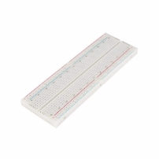
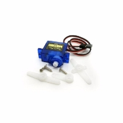
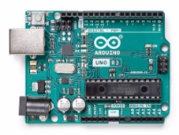
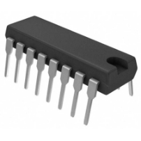
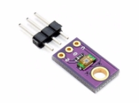
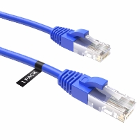
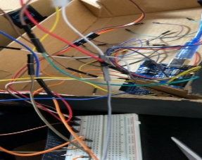
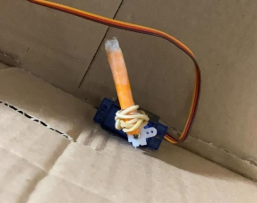
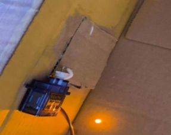

# Thanks
Thank you to my teammates for their hard work.

- [Arda Çelik](https://github.com/ardacelik1000)
- [Gökalp Çevik](https://github.com/gokalpcevik)
- [Süleyman Mehmet Güneş](https://github.com/suleymanmehmetgunes)
- [Mert Şen](https://github.com/Mertsenn)
- [Bükre Yağmur Türkoğlu](https://github.com/bukreyagmurturkoglu)

# 0 About Codebase

To be able run mobile project in your local machine, make sure you have installed Node.js. After cloning the project execute `npm i` in the project folder. You can use Expo Go app in your mobile phone to read the QR after starting the project with the command `npx expo start` or open a mobile simulator.

- Smart Home Server(async branch is the latest): https://github.com/gokalpcevik/smart-home-server
- Smart Home Arduino: https://github.com/gokalpcevik/smart-home

>  It runs without error on macOS, however you may get errors on Windows.

### Check out our [Demo](https://www.youtube.com/watch?v=Han9q4etBYw)!

# 1  Introduction

First of all, the project group members think that time is people’s most important wealth. Nowadays, it isn’t easy to think otherwise because every human being is in a race against time. This project was started to save time and increase the quality of life. The quality of people’s use of their time has positive results in their lives. It contributes to the need for socialization, one of the basic necessities of human life, in the time left behind from work life. As the quality of life increases, productive results occur in the work done.

On the other hand, in our world where energy resources are limited and are being depleted day by day, sustainable energy sources are on the agenda. Sun is one of the most sustainable sources of an alternative to electricity. It is included in this project because it can be used as a light and in any device that requires energy.

# 2  Project Details
## 2.1. Motivation

Technology continues to exist in every aspect of our lives. People already use different technologies for most of their lives. One of the main motivations of the project is that people can implement the technology and technological developments that they use every day into the project and do their daily work without effort.

The fact that the content of this project has become ordinary, such as turning on the television with remote control, has been one of the other sources of motivation. Controlling people’s own homes, like controlling the television, can provide inner peace in terms of both time-saving and security.

## 2.2. Aim of the Project

As one of the requirements of our age, people live in a time where people’s responsibilities are increasing day by day. They are exposed to small but many responsibilities and tasks, and those are time-consuming. Based on the motto of saving time, it was aimed to speed up the completion time of these tasks and significantly reduce distraction. Therefore, with the Smart Home System Mobile Application, this project was started with the belief that some of the work that people have to do manually at home can be done with a single click.

## 2.3. Importance of the Project

There are moments when people are fully focused on work and spend hours on it. It can be unhealthy and cause distraction especially if it happens during sunset. Because the screen is brighter than the light level in the room and they have to get up and turn on the lights to keep going. Another instance might be a gathering with friends, where they have dinner and play some video games when people should not miss the fun, or feel uncomfortable when doing a small task.

It is possible to power up the lights on their mobile phone, or they can change the color of the lighting, and brightness is automatically set and the window is opened to ventilate the room. All those actions depend on the device capabilities added to the room.

The prototype is designed to do the following tasks for rooms:

- Manually interacts with every functionality available in that room.
- Add supported devices to maximize efficiency.
- Login to the system to do all.

There is second functionality of the system where you can set the password for the entrance door. The first step is for a better entrance system.

Those features are promising and various functionalities can be built on top of them. As an instance, alarming the user if the entrance door is forced to open. However, tried to keep the prototype simple and solid for more advanced enhancements. To sum up, this project allows its users to be able to interact with the environment and comes with extra features to evolve it into a fully functional smart house.

## 2.4. Group Members and Tasks


|Names|Roles|
| - | - |
|Arda Çelik|Electric and Embedded Engineer, Prototype Designer, Project Resource Designer|
|Bükre Yağmur Türkoğlu|Software Developer, Report Designer|
|Gökalp Çevik|Electric and Embedded Engineer, Prototype Designer|
|Lütfü Orçun Selbasan Selbasan|Software Developer, UI Designer, Project Manager|
|Mert Şen|Software Developer|
|Süleyman Mehmet Güneş|Software Developer, UI Designer|
## 2.5. Technologies

Some technologies were needed for the smart home system project to be ready for use. These technologies are:

- Software design was associated with using React Native.
- Hardware design was associated with using Arduino UNO.
- Server-Client architecture is the communication form of the project and assigns requests to the project.
- Servo motor opens and closes the window according to the incoming request.
- LDR Sensor is recognizing the sunlight.
- The power supply supplies power to the servo motor.
- LEDs provide a variety of colors.
- Glue, scissors, and cardboard box project prototype were used.
## 2.6. Challanges

Problem 1:

In the project, it was decided that Bluetooth should be used to provide communication between the application and the Arduino system at first. React Native’s content BLE (Bluetooth Low Energy) module was used, but an error was received and could not be implemented into the application. A different way of communication was considered due to the scarcity of React Native BLE subject resources and difficulty to implement.

Solution 1:

Client - Server network architecture was used for communication. Each client software sends its requests to the server or application server[1]. Using this architecture, data can be transferred from a client to the server.

Problem 2:

The application design was accessible remotely (like the gas sensor calling the fire department in case of a fire), but it was thought that the Bluetooth connection was meaningless when the user was away from home.

Solution 2:

The application was made to work only in the home, the systems were ordered accordingly and implemented in the model.

## 2.7. Timeline


|Weeks||
| - | :- |
|Week 1|Brainstorming — The group was formed and brainstormed about how to make a project, and the project was determined.|
|Week 2|Brainstorming — Brainstorming was done about the func- tions. Requirements for the functions are calculated. LED and micro servo motor tests were carried out to understand whether the materials were working or not.|
|Week 3|Design — The software language to be used by the mobile app was chosen (React Native). The necessary task distribution was made for the efficient progress of the project. Gained knowledge about the software language to be used.|
|Week 4|Design — UI draft was created over Figma. Diagrams drafts were created (Use Case, Activity Diagram). An Arduino Side Diagram draft was created. Gained knowledge about the soft- ware language to be used.|
|Week 5|Design — Arduino studies were done. Two-way communica- tion was achieved. On Github, the developers created their own branch and the codes were started.|
|Week 6|Development & Test — UI development started.|
|Week 7|Development & Test — Diagrams are drawn. App develop- ment continued.|
|Week 8|Development & Test — Midterm Week|
|Week 9|Development & Test — App development continued. The developers worked on the BLE module. Arduino and motor are tested. The proposal report was presented.|
|Week 10|Development & Test — For the way of communication, the developers worked on the BLE module, and the embedders tried to create a server-client relationship. User interface im- provements continued. The house was designed.|
|Week 11|Development & Test — The mode of communication was agreed upon and tested on the project. Implementation of house design continued. The interim report was presented.|
|Week 12|Development & Test — Client-server tests were performed by request. The model was painted and the equipment was soldered. Bugs in the application have been resolved.|
|Week 13|Test — Videos and photos of the application were taken for presentation, and testing stages were shown.|


## 2.8. Requirement Table

|Identifier|Priority|Requirement|
| - | - | - |
|REQ1|5|The door can be opened from the application.|
|REQ2|5|The door password is determined from the mobile ap- plication. The password is changed from the phone.|
|REQ3|4|According to the brightness of the room, the lights are adjusted via the application according to the following options: bright, dim, or off.|
|REQ4|5|The light can be turned on and off manually and can also be done from the app.|
|REQ5|2|Lights can change color. Color options are: red, green, blue, and turquoise.|
|REQ6|3|Sunlight automatically turns the light on and off accord- ing to the sunlight.|
|REQ7|3|Sunlight can be turned on and off from the app.|
|REQ8|3|Unlike sunlight mode, this mode doesn’t try to adjust the room’s light level to the ideal level during the day. It powers off when lighting is not necessary.|
|REQ9|5|The window can be opened and closed from the appli- cation.|


# 3  Methodology
## 3.1. Project Design

Although it was not possible to proceed exactly according to the rules, the product was tried to be revealed in a short time by using the Agile develop- ment method. At the time of the crisis, the features were changed instantly and the work continued. The Daily Scrum has been tried and supplemented by weekly long meetings. In addition, the Test Driven Development method was adopted and after each feature was tested, it was tried to move on to the other feature. A client-server architecture (client-server model and com- puters) is required for a smart home project. According to the request from the client, a response is returned on the server and an event occurs in the model (open-close).In addition, the mobile application was made ready for use using React Native. Expo Go was used for this. The relevant button is pressed for the desired function from the mobile application. The UML diagrams below are designed to describe the application design.


Figure 1: Smart Home System Application UML Activities Diagram


Figure 2: Smart Home System Applications UML Use Case Diagram

## 3.2. Tests and Their Contents

An observational study was carried out in the project. Experiments were made with test cases, and as a result, the model was implemented according to the observed results.


|Test Case|Expected System|Status|
| - | - | - |
|The micro servo for the door|The micro servo used for the gate is driven by the power supplied by the Arduino.|PASSED|
|The micro servo for the window.|The micro servo used for the window is driven by the power supplied by the Arduino.|PASSED|
|The brightness of the LEDs|can be fully adjusted within Arduino UNO.|PASSED|
|All LEDs con- trols|All LEDs can be controlled by Arduino.|PASSED|
|Screen transi- tion on app|User can seamlessly switch between screens.|PASSED|
|Login with e- mail address|User can log in with e-mail address from App screen.|PASSED|
|Window move- ment test|When the user requests the client-server, the user can open and close the window with the help of the app.|PASSED|
|Sunlight Test|The light turns on inside the house when the light comes in from outside to give the house a light the color of sunlight.|PASSED|
|Changing the light colors sequentially|When the user presses the light change button, he gets the colors red, yellow, blue, and turquoise.|PASSED|
|Sending a re- quest to the server for door|When the request comes, it can print it on the computer screen and open the door.|PASSED|
|Sending a re- quest to the server for win- dow|When the request comes, it can print it on the computer screen and open the window.|PASSED|

# 4  Material Cost

Some materials were ordered, and some were owned by hardware developers. The total cost amounted to 139.67 TL.


|Material|Cost|
| - | - |
|Servo Motor x2|32.80 TL|
|Shifter-Register Integration|4.81 TL|
|LDR|2.19 TL|
|Light Sensor|32.80 TL|
|Jumper|12.95 TL|
|Breadboard|20.99 TL|
|Light Sensor|33,13 TL|
|Arduino UNO|FREE|
|LED|FREE|
|Solder|FREE|
|Network Cable|FREE|
|Cardboard Box|FREE|
|Solder|FREE|

# 5  Equipments

 

(a) Breadboard (b) Servo Motor

 

(c) Arduino UNO (d) LED

 

(e) Shifter Register Integration (f) LDR

Figure 3

 

(a) Light Sensor (b) Network Cable

 

(c) Jumper (d) Solder

Figure 4

# 6  Hardware Design
## 6.1. The HTTP Server

HTTP Server was written in C++, using various open-source libraries as below:

- Boost.Beast
- Boost.asio
- spdlog
- simdjson
- yaml-cpp

Although the server was designed and written in such a way that it would work really well with the Arduino, it is still general enough that it can be used for other purposes, like a general HTTP(s) server. Most of the boil- erplate code for interacting with the sockets and platform-specific APIs for networking is handled by Boost. Beast and the Boost.asio libraries. spdlog is used for logging the status of the server to the console window. simdjson is used for the parsing of the http request bodies and yaml-cpp is used for storing various types of data for the configuration of the server.

### 6.1.1. Multi-threaded Architecture

The server was written in a multi-threaded way to handle multiple requests concurrently. At the start of the application, depending on the configuration, several threads are launched and are always listening to connections coming from the transport layer. The server’s main process loop may be seen below.
``` cpp
    auto Application::Start() const -> std::int32_t
    {
        // Accept requests from all the ip addresses
        // which would be 0.0.0.0
        auto const address = ip::make_address(config::g_IpAddress);
        
        // Create the asio io_context with
        // the thread hint
        net::io_context ioc{ config::g_Threads };
        
        auto const listener = std::make_shared<server::Listener>(ioc, tcp::endpoint{ address, config::g_Port });
        
        // Starts listening for connections that are handled
        // through the asio::net::io_context
    	  listener->Start();
        
        // Run the I/O service on the requested number of threads
        std::vector<std::thread> v;
        v.reserve(config::g_Threads - 1);
        for (auto i = config::g_Threads - 1; i > 0; --i)
            v.emplace_back(
                [&ioc]
                {
                    ioc.run();
                });
        ioc.run();
        return EXIT_SUCCESS;
    }
```
### 6.1.2. Request Handling

When the client sends a request, a new session is launched from the listener which is listening for connections from all the threads and then once the reading is done, error handling is done and after that, the static function Server::HandleRequest() is called which performs further handling that is, depending on the endpoint, HTTP method verb, and the request body.

``` cpp
	void Session::OnRead(beast::error_code ec, std::size_t bytesTransferred)
	{
		boost::ignore_unused(bytesTransferred);
		// This means the connection was closed by the other side.
		if (ec == http::error::end_of_stream)
		{
			shm_trace("Connection was closed by the other side.");
			return Close();
		}
		// General error handler
		if(ec)
		{
			SHM_SV_ERR(ec);
			return;
		}
		// No error has occurred and we can go ahead and process the request.
		server::HandleRequest(std::move(m_Request), m_Lambda);
	}
```

The second argument passed into the Server::HandleRequest() function is the function object that is constructed from a generic lambda and used to send an HTTP message.

### 6.1.3. Handling Requests and the Board Communication

When a request is received on the server, all the sanity, and the validation checks such as whether the HTTP method verb can be handled correctly, endpoint exists or the request body is correctly sent are done.

If the request’s HTTP verb can be correctly handled and endpoints and the request body is correct, the request gets processed and a new command composed of a 64-bit message encoded in an unsigned integer format is issued to the Arduino via the serial line through the USB-UART converter present on the development board.

In a typical encoded message, the first eight bits represent the function. Below are a few tables explaining some of the 64-bit encoded messages that are issued to the Arduino and each command’s integer value.


|Command Enumeration|Hexadecimal Value|
| - | - |
|Brightness|0x0|
|Power|0x1|
|Smartlight|0x2|
|Sunlight|0x3|
|Window|0x4|
|Door|0x5|
|SelectColor|0x6|
Table 1: Encoded integer values for each command.


|Bits|Value|Size|
| - | - | - |
|[7:0]|Command::Brightness|1|
|[15:7]|<p>†</p><p>Room Identifier</p>|1|
|[47:16]|<p>†</p><p>Brightness Value</p>|4|
|[63:48]|Not Used|2|
|Total|− − −|8|
Table 2: 64-bit encoded message format for the brightness command. †:Passed in as an argument from the client.


|Bits|Value|Size|
| - | - | - |
|[7:0]|Command::Brightness|1|
|[15:7]|<p>†</p><p>Room Identifier</p>|1|
|[23:16]|<p>†</p><p>Power</p>|1|
|[63:24]|Not Used|5|
|Total|− − −|8|
Table 3: 64-bit encoded message format for the power command. †:Passed in as an argument from the client.


|Bits|Value|Size|
| - | - | - |
|[7:0]|Command::ChangeColor|1|
|[15:7]|Not Used|1|
|[23:16]|<p>†</p><p>Color Enumeration</p>|1|
|[63:24]|Not Used|5|
|Total|− − −|8|
Table 4: 64-bit encoded message format for the change color command. †:Passed in as an argument from the client.

### 6.1.4. Sending Commands via Win32 API

For the actual realization of the board communication, Win32 API was used. A class named shm::embedded::SerialCommunication provides a simple in- terface that can be used with minimal boilerplate configuration and initial- ization. The class is a simple wrapper around the ::WriteFile and ::ReadFile functions in the Win32 API and makes use of the COM functionality.

``` cpp
enum class BaudRate : uint32_t
	{
		BR9600    = CBR_9600,
		BR38400   = CBR_38400,
		BR115200  = CBR_115200
	};

	class SerialCommunication
	{
	public:
		SerialCommunication() = default;
		SerialCommunication(SerialCommunication const&) = delete;
		SerialCommunication& operator=(SerialCommunication const&) = delete;
		SerialCommunication(std::string_view portName, BaudRate baudRate);
		~SerialCommunication();
		bool WriteString(std::string const& message) const;
		bool Write(void const* data, std::size_t size) const;
		bool ReadBlocking(std::vector<char>& receivedData) const;
	private:
		HANDLE m_HComm{INVALID_HANDLE_VALUE};
		DCB m_DCBSerialParams{};
		std::string_view m_PortName{};
	};

```

Code 1: SerialCommunication Class Header

In the implementation of the constructor, ::CreateFileA function is called that returns the HANDLE to the opened COM port, and any error associated with the call is handled and logged to stderr. After the file creation, the DCB structure is initialized with the configured baud rate and the com port. After a valid HANDLE is obtained, writing to the serial line is done through one function which can be seen below.

``` cpp
	bool SerialCommunication::Write(void const* data, std::size_t size) const
	{
		DWORD BytesWritten;
		return static_cast<bool>(::WriteFile(m_HComm, data, (DWORD)size, &BytesWritten, nullptr));
	}
```

Code 2: SerialCommunication Write Function

### 6.1.5. Command Builder

Commands are built according to the client’s request and the request body. After a valid JSON body was received the 64-bit encoded message gets cre- ated through a helper class called shm::embedded::CommandBuilder. Some of the code for the command creation can be seen below.

``` cpp
	uint64_t CommandBuilder::BuildBrightness(ROOM room, uint32_t brightness)
	{
		// 8 + 8 + 32 = 48 bytes total
		// data[0:7] is the function id
		// data[7:15] is the room id
		// data[47:16] is the brightness value
		return
			static_cast<uint64_t>(COMMAND::Brightness) |
			static_cast<uint64_t>(room)          << 8 |
			static_cast<uint64_t>(brightness)    << 16;
	}
```

Code 3: CommandBuilder Brightness Implementation

``` cpp
	uint64_t CommandBuilder::BuildDoor(bool on)
	{
		return static_cast<uint64_t>(COMMAND::Door) | ((uint64_t)on << 8);
	}
```

Code 4: CommandBuilder Door Implementation

## 6.2. Arduino UNO Software and Hardware
### 6.2.1. Reading the Serial Line

When the 64-bit message comes in from the server via the serial line, it is read via the function Serial::readBytes(). Any unread bytes that were left from the previous read/write operations in the UART hardware buffer are cleared. Below piece of code is the general structure of the general operation described just before.

``` cpp
  void serialFlush(){
    while(Serial.available() > 0) {
      char t = Serial.read();
    }
  }

  if(Serial.available() > 0)
  {
    size_t readBytes = Serial.readBytes(buffer,8);
    if(readBytes != 8) return;

    serialFlush(); // Flushes the serial buffer in the UART hardware

    // We know that in every 64- bit message , the first byte contains the command information
    Command command = static_cast<Command>(buffer[0]);
    
    // Handle the command according to the rest
    // ..........
```

’Command’ is the enum that matches with the values in Table 1. [Co](#_page19_x102.88_y222.02)de for the enum can be seen below.

``` cpp
enum Command
{
    CMD_BRIGHTNESS=0x0,
    CMD_POWER=0x1,
    CMD_SMARTLIGHT=0x2,
    CMD_SUNLIGHT=0x3,
    CMD_WINDOW=0x4,
    CMD_DOOR=0x5,
    CMD_SELECT_COLOR=0x6
};
```

### 6.2.2. Applying the Commands

Once the command is received, it is processed in a switch statement and the other parameters are extracted from the 8-byte buffer according to the command type. Below are examples of some of the commands.

``` cpp
    switch(command)
    {
          case CMD_DOOR:
          {
            uint8_t doorState = buffer[1];
            if(doorState)
            {
              // Open the door smoothly here.
              door.write(DOOR_OPENED_ANGLE);
            }
            else
            {
              // Close the door smoothly here.
              door.write(DOOR_CLOSED_ANGLE);
            }

            break;
          }
```

Code 5: Code for the handling the door command

``` cpp
    switch(command)
    {
      case CMD_POWER:
      {
        if(sunlightOn) return;

        uint8_t powerState = buffer[2];
        if(room==BED_ROOM) 
        {
          bedroomPowerOn = powerState;
          analogWrite(BED_ROOM_LED0_PIN,(int)powerState*(int)((float)bedroom_brightness*2.55f));
        }
        else if(room==LIVING_ROOM) 
        {
          livingroomPowerOn = powerState;
          analogWrite(LIVING_ROOM_LED0_PIN,(int)powerState*(int)((float)livingroom_brightness*2.55f));
          analogWrite(LIVING_ROOM_LED1_PIN,(int)powerState*(int)((float)livingroom_brightness*2.55f));
          SoftPWMSetPercent(LIVING_ROOM_LED2_PIN,(int)livingroomPowerOn*(int)livingroom_brightness);
        }
        break;
      }
```

Code 6: Code for the handling the power command

``` cpp
    switch(command)
    {
      case CMD_SELECT_COLOR:
      {
        COLOR color = static_cast<COLOR>(buffer[1]);
        if(color == Red) WriteRGB(255,0,0);
        else if(color == Green) WriteRGB(0,255,0); 
        else if(color == Blue) WriteRGB(0,0,255); 
        else if(color == Cyan) WriteRGB(0,255,255); 
        break;
      }
```}

Code 7: Code for the handling the change/select color command

The RGB LEDs are controlled through three different pins for each LED, and the pins were chosen to have PWM capability.

### 6.2.3. Pin Connections

Pin connections have been carefully selected and where the PWM pins were not enough, software emulated PWM functionality was used through the SoftPWM library.

``` cpp
#define RGB_LED_R_PIN 9
#define RGB_LED_G_PIN 10
#define RGB_LED_B_PIN 11

#define BED_ROOM_LED0_PIN 3

#define LIVING_ROOM_LED0_PIN 5
#define LIVING_ROOM_LED1_PIN 6
#define LIVING_ROOM_LED2_PIN 12

#define DOOR_SERVO_PWM_PIN 4
#define WINDOW_SERVO_PWM_PIN 8
```

Code 8: Pin Definitions in the HomeDefinitions.h file

### 6.2.4. Light Sensor and Sunlight Mode

Light sensor TEMT6000 outputs an analog signal which is then sampled on the built-in ADC present on the Arduino UNO.

Sunlight mode is a mode of the smart home that emulates the sunlight throughout the day, thanks to the sensor located just outside the smart home.


Figure 5: TEMT6000 Light Sensor


Figure 6: Sunlight Mode Lights

## 6.3. Physical Design

Two cardboards were used in this project. One for smart home another one for hiding cables, breadboard, and UNO card. The wider cardboard is fully connected with the smart home as can be seen below.



Figure 7: Cable Connections

When the project was started, the first idea that came to mind for the LED connection was to strap the LEDs to jumpers with electrical tape. During the project, it was discovered that the connection was going to be poor. It was going to cause an issue during the presentation. That’s why it was thought that soldering them to the copper plate would be much safer. This can be verified through the accompanying photographs below.


Figure 8: Bottom Copper Plate with Soldered Components

Two micro servos were used in this project. They were used for the window and door. The angles of these motors were carefully measured, and the most suitable angles were selected. They were strapped with double- sided tape. The bottom of the cardboard was opened, and the three cables coming from the servo were connected via jumper cables to the breadboard located below the smart home.


|Servo|Closed Angle|Opened Angle|
| - | - | - |
|Door|105◦|40◦|
|Window|80◦|30◦|
Table 5: Angles for the micro servos



Figure 9: Attached Door Micro Servo


Figure 10: Micro Servo Tip



Figure 11: Attached Window Micro Servo

There is a yellow LED located in the bedroom. This LED has 2 legs, one of them is longer the other one is shorter. The shorter one is grounded on the breadboard. The longer one is located on a digital pin.

# 7  Software Design
## 7.1. Authentication

Firebase has been used to provide communication between Arduino and the mobile application. It is a toolset to “build, improve, and grow the applica- tion.” The tools it gives cover a large portion of the services that developers would normally have to build themselves but many do not want to build because mostly rather be focused on the application experience itself. This includes things that can be listed as analytics, authentication, databases, configuration, file storage, push messaging, and the list goes on. The ser- vices are hosted in the cloud and scale with little to no effort on the part of the developer.


Figure 12: Required libraries have been supplied for interaction between Fire- base and React Native. Also, the credentials attributes have been imported to assign firebaseConfig Instance.


Figure 13: With the initializeApp (firebaseConfig) line, Firebase configura- tion has been assigned to initializeApp method to initialize the Firebase. In the getAuth(app), initialize Firebase authentication and get a reference to the service. In the end, the getFirestore(app) returns the existing default Firestore instance that is associated with the provided FirebaseApp.


Figure 14: registerRootComponent instance sets the initial React component to render natively in the app’s root React Native view on iOS, Android, and the web. The App component has been inserted into it.

## 7.2. Redux

Redux is a state management tool that works as a centralized store which means it is the only place to access the state. Redux is also known as the single source of truth. The single source of truth is the only place where the application’s state lives and can be accessed.


Figure 15: The configureStore has been imported to provide a friendly ab- straction over the standard Redux. The createStore function adds good defaults to the store setup for a better development experience. It takes a single argument which is called a reducer. It takes the current state and ac- tion then returns to the next state. In our case, three components have been assigned, after the importation part which are counterReducer from coun- terSlice, onboardingReducer from onboardingSlice, and loginReducer from loginSlice. In any case, the aim of the usage of counterReducer is to test Redux only.


Figure 16: After store configuration, dispatch is needed usage. It is a function of the redux store to dispatch an action. That is the only way to trigger a state change.


Figure 17: The importance of createSlice maintains a function that accepts an initial state, an object of reducer functions, and a slice name. It automatically generates action creators and action types that correspond to the reducers and state.

In this situation, “onboarding” has been selected as a slice name, initial- State’s value has been assigned as ”false” due to conflict on starting screen. Reducer functions are named as setIsFirstLaunch, and SetIsNotFirstLunch which have an access to onboarding.js to manipulate the props and variables. Calling the function of setIsFirstLaunch causes changes on the initialState as “true” and initializes the onboarding screen. After there is nothing left, the initialization of the onboarding screen has been finished and initializeState has been assigned as false. In the final part, functions have been appointed as onboardingSlice actions to be generated for each case reducer function.


Figure 18: In the loginSlice.js file, the createSlice procedure is used again. This time login was picked as the slice name. Initial states initialized as loggedIn that provides to check authentication has started successfully. load- ingMassage serves as a printing “Trying to login...” waiting screen, and last but not least, users and rooms have initialized as an empty object to be ma- nipulated by users. In the last part, reducer functions have been identified. setLoggedin is responsible for changing the loggedIn state as true and trans- ferring the data. setLoggedOut set loggedIn state as false. The setRooms provides to transfer data associated with the room object, and finally, set- LoadingMessage supplies to dispatch the data related to loadingMessage.


Figure 19: Necessary libraries have been called in App.js to work the project properly. In the figure, The provider component makes the Redux store available to any nested components that need to access the Redux store. Since any React component in a React Native Redux app can be connected to the store, most applications will render a provider at the top level, with the entire app’s component tree inside of it.

## 7.3. Packages


The libraries that are used in this project are listed as UI, and Routing. Those are as follows:

### 7.3.1. UI Libraries

react-native-radio-buttons-group: It is a basic React Native li- brary that contains radio buttons.

react-native-animated-radio-button-group: It is a basic radio button but the user can set the size of the font, and change the inner, and outer colors for each of them. They take all props which are available on react-native-animated-radio-button-group. It also includes animation fig- ures.

react-native-bouncy-checkbox: It is a basic checkbox but the size and color of the shape of the box can be arrangeable.

react-native-element-dropdown: It is a package that consists of dropdown and multi-select in one package.

react-native-paper: react-native-paper is the cross-platform UI kit library containing a collection of customizable and production-ready com- ponents, which by default are following and respecting Google’s Material Design guidelines.

react-native-swiper: react-native-swiper is a library that is used to swipe the content like the image or full screen. The whole screen or some part of the screen can be swipeable. It can be given as an example of an image slider.

react-navigation/bottom-tabs: A simple tab bar on the bottom of the screen that lets the user switch between different routes.

react-native-community/slider: React Native component used to select a single value from a range of values.

react-native-dropdown-select-list: It is a library that bunch of select list options inserted into a single select list bar that shows all select lists when it has been clicked.

### 7.3.2. Routing Libraries

react-navigation/native: React Navigation is made up of some core utilities and those are used by navigators to create the navigation structure in the app.

react-navigation/native-stack: Stack navigator for React Native using native primitives for navigation.

react-navigation/stack: Stack navigator provides a way for app to       transition between screens where each new screen is placed on top of a stack.

### 7.3.3. Other Libraries

react-native-async-storage/async-storage: An asynchronous, un- encrypted, persistent, key-value storage system for React Native.

react-native-firebase/app: It is a library that calls Firebase. reduxjs/toolkit: Includes utilities to simplify common use cases like store

setup, creating reducers, immutable update logic, and more.

axios: It is a library that has an isomorphic HTTP client. That means it can run in the browser and the Node runtime environment. As a result, the client can use the same codebase for making API requests in Node, in the browser, and in React Native.

dotenv: dotenv is a lightweight npm package that automatically loads environment variables from a .env file into the process. env object.

react-redux: It is a package that calls redux which allows React com- ponents to read data from a Redux Store, and dispatch Actions to the Store to update data.

react-native-walkthrough-tooltip: react-native-walkthrough-tooltip is a fullscreen modal that highlights whichever element it wraps. When not visible, the wrapped element is displayed normally.

react-native-dotenv: This babel plugin lets the user inject the user’s environment variables into the user’s react-native environment using dotenv for multiple environments.

expo: expo is an open-source platform for making universal native apps for Android, iOS, and the web with JavaScript and React.

expo-status-bar: It gives a component and imperative interface to control the app status bar to change its text color, background color, hide it, make it translucent or opaque, and apply animations to any of these changes.

redux-saga: It is a middleware library used to allow a Redux store to asynchronously interact with resources outside of itself.

lodash: It is a JavaScript library, which focuses on delivering high- performing react native functions.

# 8  Results & Discussions

The existing functions work as expected if the hardware in the house supports it. So far users can interact with light via switch buttons, door via password change and open-close switches, and window open-close switches. The most valuable contribution would be solving the bugs of the existing system and making necessary adjustments to the software architecture of both client and server applications, thus it provides a necessary resiliency to expand the feature set in a reliable way. On the other hand, if it is decided to add new functions as a primary goal those can be adding a security system that alarms the user in case of emergency like a fire, burglary, gas leak, etc. However, the user should connect to the home server in a different way other than typing the IP address.

As a new feature set to follow sustainability goals, new devices can be built in the house that consumes energy from clean energy resources and those features can work autonomously with the help of artificial intelligence. Example functionalities can be as follows:

- Choose the right time to use machines that are used in chores, the right time may include that the battery supplied by the clean energy source is available
- Adjustment of temperature by given parameters like estimated time spent in the house. It can be implemented in a way that doesn’t waste energy.
- If necessary devices are affordable and can be installed on the server, some of the chores can be autonomous. As an example, a coffee machine serves fresh coffee at a specific time of the day.
  
# 9  Conclusion

Industrial Revolution, in modern history, the process of change from an agrarian and handicraft economy to one dominated by industry and ma- chine manufacturing. These technological changes introduced novel ways of working and living and fundamentally transformed society. [1] Although the necessities of living in the industrialized world give people the chance to live together with technology, the psychological damage caused by this tempo can be high. It was aimed to increase the moments that people can spare for themselves. On the other hand, in our world where energy consumption is increasing and continues to increase day by day and wastes poisoning nat- ural resources, this project can lead to energy savings, especially in the use of factories, since it has a feature such as automatic sunlight. However, of course, this project should become widespread and an indispensable part of daily life so that its benefits can be fully seen.

# References

1. https://www.britannica.com/event/Industrial-Revolution
2. Devices are ordered and images are retrieved from https://www.direnc.net
3. Code images are generated at https://carbon.now.sh
4. Mobile application packages are installed from https://www.npmjs.com
5. Mobile application codes are retrieved from https://github.com/OrcunSelbasan/smarthome
6. Programming reference for the Win32 API - Win32 apps. (n.d.). Mi- crosoft Learn. https://learn.microsoft.com/en-us/windows/win32/api/
7. Arduino Docs. (n.d.). Arduino Documentation. https://docs.arduino.cc/
8. Boost.Beast Documentation. (n.d.). https://www.boost.org/doc/libs/1__70__0/libs/beast/doc/html/index.html/
9. Boost.Asio - 1.75.0. (n.d.). https://www.boost.org/doc/libs/1__75__0/doc/html/boostasio.html
